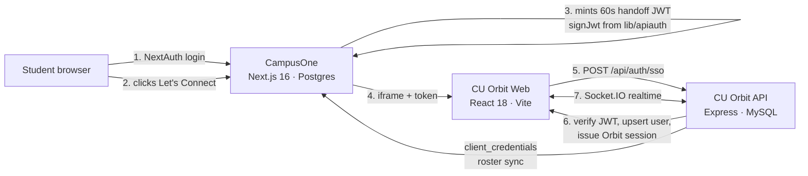

# CU Orbit → CampusOne Integration Plan

How CU Orbit becomes a messaging microservice inside CampusOne
(`campusone.cutm.ac.in`), reachable from the side menu as **Let's Connect**.

**Hard constraint: existing CampusOne behaviour must not change.** Section 3
lists every CampusOne file touched and why each is additive.

---

## 1. Target architecture



Two services, two databases, one identity source. CampusOne stays the
authority on who a person is; CU Orbit owns messages.

### Why a handoff token rather than a shared cookie

CU Orbit runs on a different origin, so it cannot read CampusOne's NextAuth
cookie. CampusOne's existing `client_credentials` grant
(`app/api/v1/oauth/token/route.ts`) authenticates a *client*, not a *user* —
it carries no `sub`, so it cannot tell CU Orbit who is chatting. The handoff
token fills exactly that gap and reuses the `signJwt`/`verifyJwt` helpers
already in `lib/apiauth.ts`.

Token shape (HS256, `API_JWT_SECRET`, 60s TTL, single use):

```json
{ "sub": "<campusone user id>", "email": "...@cutm.ac.in",
  "name": "...", "role": "student|faculty|admin",
  "aud": "cu-orbit", "iat": ..., "exp": ... }
```

Short TTL because the token appears in a `postMessage` payload. CU Orbit
exchanges it once for its own session and never stores it.

---

## 2. CU Orbit changes (all of them)

### Phase 1a — identity rekey (written, awaiting dry-run)

Every table keys users by phone number today; `dm_id` is two phone numbers
joined by `_`. Campus SSO identifies people by email, so phone cannot remain
the key. `migrations/001-phone-to-uuid.js` rekeys onto the existing
`User.id` UUID across 8 locations in 7 tables, including the `dm_id`
composite and the `Thread.participant_ids` JSON array. Idempotent, runs in a
transaction, has `--dry-run`.

### Identity mapping — CampusOne is the directory

CampusOne already holds every student and faculty member, with mobile numbers:

- `roster` — `email text PRIMARY KEY`, plus `name, regno, cohort, role_override`, and `mobile` (added later by `ALTER TABLE`).
- `faculty` — also carries `mobile`.

So CampusOne's canonical identity is **email**, not a numeric ID. CU Orbit
keys internally on its own `User.id` UUID and stores `campus_email` as a
unique link column. Two reasons not to key directly on email:

1. If a person's campus email ever changes, one column updates and all message history stays attached.
2. CU Orbit keeps working for any account that has no CampusOne record (the Android-only fallback), rather than requiring an email for every row.

**CU Orbit stops owning a user directory.** `User` becomes a projection of
CampusOne: rows are created on first SSO login and refreshed from
`/api/v1/roster` via the existing `client_credentials` grant. Registration and
profile-editing endpoints in CU Orbit are retired or made read-only, since
CampusOne is the authority for name, role, and cohort.

#### Auto-linking existing users

Because `roster.mobile` and `faculty.mobile` exist, the phone numbers already
in CU Orbit map to campus emails without asking anyone to do anything:

```
CU Orbit User.phone ──normalize──> match roster.mobile / faculty.mobile ──> email ──> campus identity
```

Migration 001 therefore gains a linking step: resolve each phone against the
CampusOne roster, write `campus_email` onto the matching CU Orbit user, and
leave unmatched users local-only. Caveats to check against real data first:

- `mobile` was added to `roster` by a later `ALTER`, so it may be sparsely populated — unmatched users must degrade gracefully, not break.
- Formats differ. CU Orbit normalizes to the last 10 digits; CampusOne's `mobile` is free-text `TEXT`. Matching must normalize both sides identically.
- Two CampusOne rows sharing a mobile (siblings, shared family number) must be reported and skipped rather than linked arbitrarily.

### Phase 1b — real authentication

Today `/api/auth/login` returns a user for any phone number posted, with no
password or token, and every endpoint reads the caller's identity straight
from the URL. **Anyone who can reach the API can read every DM.** This phase:

- `POST /api/auth/sso` — verify handoff JWT, upsert user by campus email, issue an Orbit JWT (access + refresh).
- `requireAuth` middleware setting `req.user`; applied to all ~35 endpoints.
- Replace every `:userId` path param with `req.user.id`.
- Authorization checks: channel membership before reads, DM participation before history.
- Replace `sequelize.sync({ alter: true })` (auto-ALTERs prod on every boot) with explicit migrations.
- Retain phone/OTP only as an Android fallback, if wanted.

### Phase 2 — realtime

Polling today: the portal runs `setInterval(loadMessages, 3000)`; typing is a
REST endpoint with a 5s window. Socket.IO on the same HTTP server, rooms
`channel:{id}` and `dm:{id}`, authenticated by the Orbit JWT in the socket
handshake. Events: message create/edit/delete, reaction, typing, presence,
read receipt. REST stays for history and pagination.

### Phase 3 — one web client

Three frontends exist: Kotlin app, vanilla-JS portal (`server/public/`, live),
and an unbuilt React app (`web/`). Finish `web/`, apply CampusOne's palette,
build into `server/public/`, delete the vanilla portal. Ship as a PWA so
desktop and iOS get an installable client.

Iframe requirements on the CU Orbit side:
- `Content-Security-Policy: frame-ancestors https://campusone.cutm.ac.in`
- Must be served over HTTPS (CampusOne sends `upgrade-insecure-requests`).
- Session cookie `SameSite=None; Secure`, or bearer token in memory.

### Phase 4 — operability

`server.js` is 850 lines holding routes, models, and an inline HTML landing
page; a corrupted 4-line block sat undetected there and crash-looped
production 88 times. Split into modules, add `/api/health` (documented in the
README, never built), add a CI check running `node --check` plus a boot smoke
test.

### Phases 5–6

FCM push for Android and web; message search (MySQL `LIKE` will not scale —
full-text or Meilisearch); WebRTC calls with a TURN server, replacing the
current log-only Calls feature.

---

## 3. CampusOne changes — the isolation guarantee

Verified against `next.config.ts`, `middleware.ts`, and
`app/components/Shell.tsx`.

| File | Change | Risk |
|---|---|---|
| `app/connect/page.tsx` | **New file** | None — new route |
| `app/api/connect/token/route.ts` | **New file** | None — new endpoint |
| `app/components/Shell.tsx` | **+1 nav item** in existing arrays | Additive |
| `next.config.ts` | **No change** | — |
| `middleware.ts` | **No change** | — |
| `.env` | `+ORBIT_URL` | Additive |

### Why `next.config.ts` needs no change

The CSP is:

```
upgrade-insecure-requests; frame-ancestors 'self'; connect-src 'self' ...;
worker-src 'self' blob:; media-src 'self' blob: data:; img-src 'self' data: blob: https:
```

- `frame-ancestors 'self'` and `X-Frame-Options: SAMEORIGIN` control **who may frame CampusOne**. They do not restrict what CampusOne may frame, so embedding CU Orbit does not violate them.
- There is **no `frame-src`/`child-src` and no `default-src`**. CSP has no implicit fallback for unlisted directives absent `default-src`, so framing a third-party origin is already permitted.
- `connect-src 'self'` applies to CampusOne's own document. The iframe is a separate browsing context governed by CU Orbit's CSP, so Socket.IO traffic from inside the frame is unaffected.

**Consequence:** the existing security headers stay byte-for-byte identical.
If we ever tighten them, `frame-src https://<orbit-host>` gets added — but
that is not required now.

### Why `middleware.ts` needs no change

`isPublic()` covers `/`, `/auth`, `/api/auth`, `/exam-browser`, `/sfs`.
`/connect` is not in that list, so it is **protected by default** — `withAuth`
gates it and unauthenticated users are redirected to `/auth/signin`. The
role-redirect chain is a series of `if (p.startsWith(...))` guards, none of
which match `/connect`, so no existing redirect changes behaviour. Rate
limiting already covers `/api/*`, which the new token endpoint inherits.

### The one modified file

`Shell.tsx` builds role-scoped `Item[]` arrays (`STUDENT_NAV`, `FACULTY_NAV`,
`ADMIN_NAV`, …). The change is one entry per role array:

```ts
{ href: "/connect", label: "Let's Connect", icon: MessageCircle }
```

`Item` already supports this shape; `MessageCircle` comes from `lucide-react`,
already a dependency. No component logic, no rendering, no existing entry
touched.

### Next.js 16 caution

`AGENTS.md` states this is not the Next.js in my training data and requires
reading `node_modules/next/dist/docs/` before writing code. Both new files
will be written against those docs, not from memory.

---

## 4. Rollback

| Layer | Rollback |
|---|---|
| CampusOne | Revert one commit — 2 new files deleted, 1 nav line removed. No schema, no config. |
| Side menu only | Remove the nav entry; `/connect` becomes unreachable while staying deployed. |
| CU Orbit API | `pm2` restart on the previous commit. |
| Identity migration | Restore the `mysqldump` taken before applying. **The only step that is not a code revert.** |

The migration is the sole irreversible action in the plan. It runs once,
after a verified dry-run and a fresh backup.

---

## 5. Sequencing and dependencies

```
1a identity ──> 1b auth ──> 1c CampusOne wiring ──> 3 web client ──> 5 push
                    └──> 2 realtime ──────────────────┘        └──> 6 search / calls
                    4 operability (parallel, any time)
```

1a→1b is strict: auth needs stable identity keys. 1b→everything is strict:
sockets, clients, and push all authenticate against the session from 1b.
Building any of them first means rewriting them afterwards.

Phase 4 has no dependencies and can run alongside anything.

---

## 6. Open items

- **Dry-run output** for migration 001 — orphaned keys and duplicate phones change how 1b handles missing users.
- **Roster mobile coverage** — how many `roster`/`faculty` rows actually have `mobile` populated, and in what format? Determines how many existing CU Orbit users auto-link versus needing a manual claim flow.
- **CampusOne palette** — to be read from its Tailwind config and `globals.css` in Phase 3, not approximated.
- **Hosting** — CU Orbit needs HTTPS and a stable hostname before the iframe works. Subdomain of `cutm.ac.in` recommended, which also simplifies cookie policy.
- **Roster sync scope** — which `client_credentials` scopes CU Orbit is granted for auto-provisioning channels from `/api/v1/roster`.
